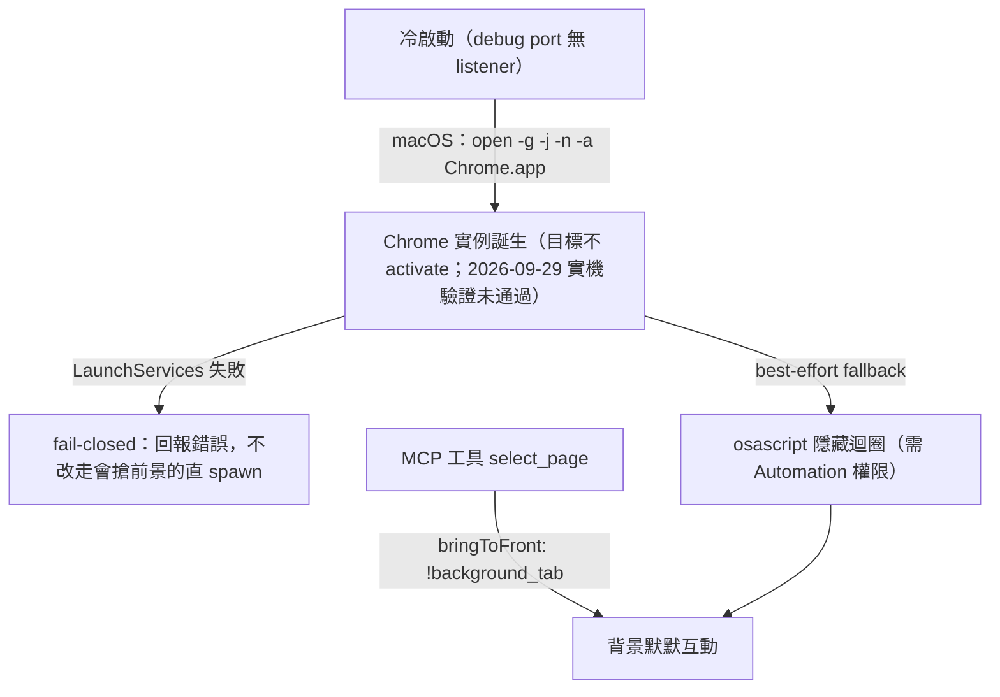

# macOS 完美的背景 Chrome 隱形技術與實作原理 🦀

在 `ask-bridge` 中，為了解決網頁自動化工具經常面臨的 **Cloudflare Bot 偵測**與 **macOS 視窗閃爍**問題，我們開發了一套極具巧思且穩定的「真．背景隱形（Headless Bypass）」技術。

本文件詳細記錄了這套技術的挑戰、核心原理與最終解決方案，供未來開發與維護參考。

---

## 1. 核心挑戰：Cloudflare 與 視窗克制

### 1.1 為什麼不能用標準的 `--headless` 模式？
當我們使用 Chrome 內建的 `--headless` 參數時，Chrome 會啟用無介面渲染。然而，這會暴露出非常明顯的機器人特徵（例如 `navigator.webdriver` 屬性為 `true`、特定的 Chrome 屬性缺失、以及缺乏部分 WebGL 繪圖特徵）。
這會直接導致 `chatgpt.com` 啟用的 **Cloudflare Turnstile** 阻擋請求，讓頁面卡在驗證碼或拋出 `No assistant message found` 錯誤。因此，**我們必須啟動標準的 Headful（有介面）Chrome 才能完美繞過偵測。**

### 1.2 有介面啟動的視覺困擾
在 macOS 上，一旦啟動 Headful Chrome，作業系統的視窗管理器（WindowServer）預設會為其繪製一個實體視窗，這會造成：
- 視窗強行跳出、搶奪焦點，打斷使用者的工作流程。
- 使用 `--window-position=-2000,-2000` 來將視窗定位到螢幕外，會被 macOS 視窗管理器**強制黏回（Clamp）** 螢幕邊緣（如 `0,26`），因為 macOS 預設不允許有介面程式的視窗控制列完全超出可視範圍。

### 1.3 為什麼「先啟動、後隱藏」不夠？
先前版本用 `Command::spawn` 直接啟動 Chrome 執行檔，再以背景執行緒輪詢
AppleScript `set visible ... to false` 補救。這條路徑有兩個結構性問題：

- **啟動即前景（app activation）**：macOS 會把新誕生的 Regular application 設為
  active，視窗被 order front、Chrome 成為 frontmost app，這是「啟動」這個動作本身的
  副作用；補救用的 AppleScript 是非同步的，最快也要等下一次輪詢才會執行，於是使用者
  會先被搶一次焦點。
- **補救依賴額外權限**：`System Events` 的 `set visible` 需要 Automation 權限；未授權
  時 `osascript` 只會失敗，Chrome 就停留在可見、可能被帶到前景的狀態。

因此修復方向是「**在啟動階段就要求 macOS 不要 activate**」，而不是在啟動後追著隱藏。

---

## 2. 解決方案：三大隱形技術之結合

為了解決上述挑戰，我們在 `src/main.rs` 中融合了三項底層技術，達成了 **「完全無感、完全隱形、完美繞過偵測」** 的境界。



---

### 技術一：LaunchServices 隱藏啟動（冷啟動不 activate）

背景任務需要新開 Chrome 實例時（debug port 上還沒有 listener），`ask-bridge` 不再直接
`Command::spawn` Chrome 執行檔，而是呼叫 macOS 的 LaunchServices：

```sh
open -g -j -n -a "/Applications/Google Chrome.app" --stdout /dev/null --stderr /dev/null \
  --args --remote-debugging-port=9223 --user-data-dir=<profile> --ask-bridge-instance \
         --no-first-run --no-default-browser-check --ask-bridge-background \
         --disable-blink-features=AutomationControlled --window-size=1440,1200 \
         --window-position=-2000,-2000
```

- `-g`：不要 bring to foreground（不 activate）。
- `-j`：以 hidden 狀態啟動應用程式。
- `-n`：即使 Chrome 已在執行也開新實例（維持原本的 profile 隔離語意）。

`start_chrome_if_needed` 會檢查 `open` 的退出狀態；**失敗時直接回報錯誤，不會退回會搶
前景的直 spawn**（fail-closed）。`open` 會立即退出且不回報瀏覽器 PID，因此後續改由
debug port 的 listener 反查真正的 Chrome PID。

> ⚠️ **2026-09-29 實機驗證未通過**：使用此機制仍觀察到 managed Chrome 在啟動後約
> 0.5 秒成為 frontmost app（維持約 4.6 秒後才交還焦點）；`open -g -j` 的 activate 抑制
> 在本機環境（macOS 27.0 / Chrome 154）未生效。另有兩點待修：下方的 AppleScript
> 備援因語法錯誤（`whose unix id <PID>` 缺少 `is`，osascript 回報 -2740）全數失敗，
> 等同無效備援；實測時環境中另有其他 Chrome 實例，需在乾淨環境重驗。

### 技術一之一：AppleScript 隱藏迴圈（best-effort fallback）

即使 `open -g -j` 已要求隱藏啟動，仍保留一段有界（bounded）的 AppleScript 隱藏迴圈
作為備援，避免少數 Chrome build 仍浮出視窗：

```applescript
tell application "System Events" to try
    set visible of first application process whose unix id <PID> to false
end try
```

它透過 debug port 反查實際 Chrome PID，每隔 `100 毫秒` 重試、最多 `20` 輪。這條路徑
**只**是備援：需要 `System Events` Automation 權限，未授權時會失敗，而且它是非同步的，
無法阻止「啟動本身」的 activate；負責不搶前景的是技術一。

---

### 技術二：帶有精準 PID 隔離的 AppleScript 控制

一般網路上常見的 AppleScript 隱藏指令為：
`tell application "Google Chrome" to set visible to false`
這會產生嚴重的副作用——**這會連帶把使用者平常拿來上網、工作用的主要 Chrome 視窗也一併隱藏**，體驗極差。

**我們的解決方案：**
我們利用 Rust 動態獲取當前運行的特定背景 Chrome 的系統 PID（透過 `child.id()` 或是透過 `lsof -iTCP:9223` 獲取的監聽 PID），並在 AppleScript 中使用 `whose unix id is <PID>` 進行篩選。
- **效果**：**只隱藏我們用來做 ChatGPT 互動的那個特定 PID 程序**，使用者的其他日常 Chrome 視窗完全不受干擾，兩者完美隔離。

---

### 技術三：可見性與分頁前景／背景解耦

這是我們發現的另一個關鍵「背刺」點：
在我們的流程中，需要頻繁調用 `chrome-devtools` MCP 伺服器的 `select_page` 工具來選取 ChatGPT 分頁並進行內容擷取。
- **舊行為**：每一次調用 `select_page` 時，都傳遞了 `"bringToFront": true`。在 Chromium 的內部機制中，這個操作會發送 `Page.bringToFront` 指令，這會**強制將 Chrome 應用程式帶到最前台並取消隱藏**。這就是為什麼每次一抓取內容，原本藏好的瀏覽器又會突然彈出來的原因。
- **舊語意的問題**：先前版本把兩件事綁死——`headless=true` 同時代表「Chrome 隱藏」與
  「分頁走背景」，且 `bringToFront: !headless`。想在不改變可見性的情況下獨立控制分頁
  前景／背景是不可能的。
- **新契約**：
  - `--headless`：只控制 Chrome 實例可不可見。
  - `--background-tab`：只控制自動化分頁是否以 CDP `background: true` 建立、以及
    `select_page` 是否帶 `bringToFront`。未指定時沿用歷史預設
    （`background_tab = headless`），因此舊呼叫端行為不變。
  - 新頁面建立：`isolated_new_page_args(url, background_tab)` → `{"background": background_tab}`。
  - 既有分頁選取：`"bringToFront": !background_tab`。
- **效果**：當 `background_tab` 為 `true` 時，`bringToFront` 為 `false`，Chrome
  默默地在後台執行 DOM 解析、腳本執行與按鈕點擊，**終身不浮出水面**。

`capabilities --json` 會宣告這兩條契約：`background_isolated_tab_v1`
（`new_page_background=headless`、`foreground=visible`、
`scope=isolated-new-tab-only`，並提供 `new_page_background_flag=--background-tab`）
與 `background_launch_isolation_v1`（`launch_activation=suppressed`、
`launch_visibility=hidden`、`scope=cold-start-only`）。

---

## 3. 程式碼核心實作位置

### 3.1 隱藏啟動與備援隱藏
實作於 `src/main.rs` 的 `background_chrome_launch_plan` 與 `start_chrome_if_needed`：
```rust
// open -g -j -n -a <Chrome.app> --stdout /dev/null --stderr /dev/null --args <chrome args>
let plan = background_chrome_launch_plan(&chrome_path, &chrome_args)?;
let status = Command::new(&plan.program).args(&plan.args).status()?;
if !status.success() {
    return Err(/* LaunchServices 拒絕隱藏啟動，fail-closed */);
}

// best-effort fallback：由 debug port 反查真正的 Chrome PID 後再隱藏
thread::spawn(move || hide_ask_bridge_chrome_pids(&profile_path));
```

### 3.2 分頁前景／背景控制
實作於 `src/main.rs` 的 `isolated_new_page_args` 與 `select_page` 呼叫端：
```rust
fn isolated_new_page_args(url: &str, background_tab: bool) -> Value {
    serde_json::json!({ "url": url, "background": background_tab })
}

call_mcp_tool(
    config_path,
    "select_page",
    serde_json::json!({
        "pageId": page.id,
        "bringToFront": !background_tab // 只有前景分頁才帶到最前
    }),
)?;
```

---

## 4. 總結

透過這套結合了：
1. **LaunchServices 隱藏啟動（`open -g -j -n`，冷啟動不 activate，失敗即 fail-closed）**
2. **精準 PID 隔離的 AppleScript 備援隱藏（僅在 `System Events` 權限可用時生效）**
3. **可見性（`--headless`）與分頁前景／背景（`--background-tab`）解耦，取消 DevTools `bringToFront` 前景調用**

本方案的目標是解決有介面 Chrome 做背景自動化時的視覺困擾，並讓首次啟動不再依賴
「延遲補救」。整合端可透過 `background_isolated_tab_v1` 與 `background_launch_isolation_v1`
兩個能力宣告，在送出工作前以 fail-closed 方式檢查這條「不得搶前景」契約；⚠️ 但
`background_launch_isolation_v1` 宣稱的冷啟動行為在 2026-09-29 實機驗證未通過
（Chrome 仍會被帶到前景），修正完成前請將冷啟動視為可能搶前景。
